# **Mindly - Mental Health and Wellbeing Platform**

## Milestone Project 4

Mindly is a full-stack web application that empowers users to track their mental wellbeing, journal their thoughts, and access premium support services. The platform combines mood tracking, journaling, and optional premium content behind a secure Stripe subscription system.

This project demonstrates professional backend development, full-stack integration, relational database design, payment processing, and industry-standard security practices using Django 4.2, Bootstrap 5, SQLite, and Stripe.

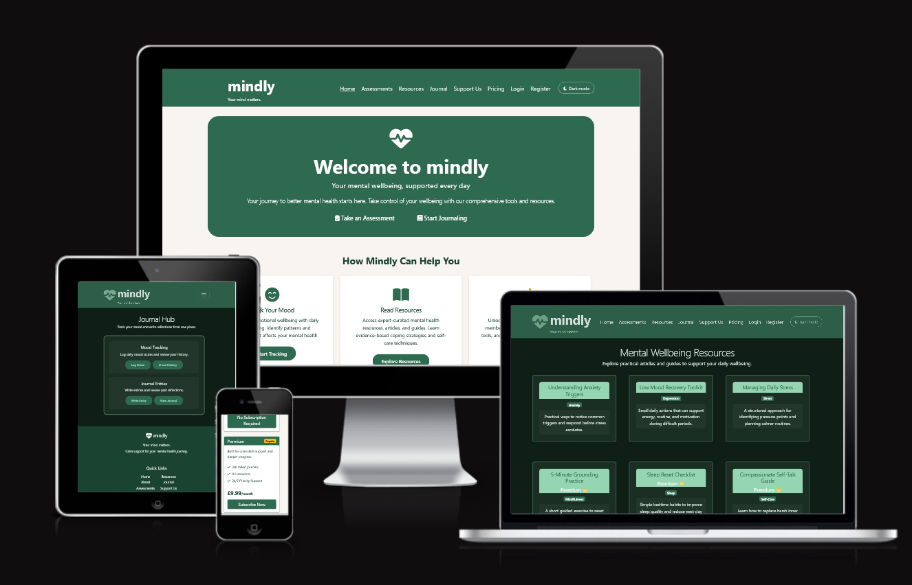

---

## **Table of Contents**

<ol>
   <li><a href="#milestone-project-4">Milestone Project 4</a></li>
   <li><a href="#project-goals">Project Goals</a></li>
   <li><a href="#real-world-rationale">Real-World Rationale</a>
      <ul>
         <li><a href="#what-success-looks-like">What Success Looks Like</a></li>
      </ul>
   </li>
   <li><a href="#development-strategy">Development Strategy</a>
      <ul>
         <li><a href="#build-constraints-and-decisions">Build Constraints and Decisions</a></li>
         <li><a href="#development-process-and-version-control">Development Process and Version Control</a></li>
      </ul>
   </li>
   <li><a href="#live-project">Live Project</a>
      <ul>
         <li><a href="#key-interface-screenshots">Key Interface Screenshots</a></li>
         <li><a href="#error-and-edge-case-screenshots">Error and Edge-Case Screenshots</a></li>
      </ul>
   </li>
   <li><a href="#repository">Repository</a></li>
   <li><a href="#badges">Badges</a></li>
   <li><a href="#user-experience">User Experience</a>
      <ul>
         <li><a href="#user-stories">User Stories</a></li>
         <li><a href="#first-time-users">First-time Users</a></li>
         <li><a href="#returning-premium-users">Returning Premium Users</a></li>
      </ul>
   </li>
   <li><a href="#design">Design</a>
      <ul>
         <li><a href="#wireframes-and-planning">Wireframes and Planning</a></li>
         <li><a href="#wireframe-to-final-changes">Wireframe to Final Changes</a></li>
         <li><a href="#design-overview">Design Overview</a></li>
         <li><a href="#colour-scheme">Colour Scheme</a></li>
         <li><a href="#typography">Typography</a></li>
         <li><a href="#accessibility-in-design">Accessibility in Design</a></li>
      </ul>
   </li>
   <li><a href="#features">Features</a>
      <ul>
         <li><a href="#all-pages-features">All Pages Features</a></li>
         <li><a href="#authentication-features">Authentication Features</a></li>
         <li><a href="#mood-tracking-features">Mood Tracking Features</a></li>
         <li><a href="#journal-features">Journal Features</a></li>
         <li><a href="#assessment-features">Assessment Features</a></li>
         <li><a href="#premium-features">Premium Features</a></li>
         <li><a href="#resource-library">Resource Library</a></li>
         <li><a href="#payment-features">Payment Features</a></li>
      </ul>
   </li>
   <li><a href="#future-features">Future Features</a>
      <ul>
         <li><a href="#user-experience-improvements">User Experience Improvements</a></li>
         <li><a href="#premium-content-expansion">Premium Content Expansion</a></li>
         <li><a href="#technical-enhancements">Technical Enhancements</a></li>
      </ul>
   </li>
   <li><a href="#data-model-and-schema">Data Model and Schema</a>
      <ul>
         <li><a href="#model-summary">Model Summary</a></li>
         <li><a href="#relationships">Relationships</a></li>
         <li><a href="#erd-ascii">ERD (ASCII)</a></li>
      </ul>
   </li>
   <li><a href="#backend-frontend-flow-examples">Backend-Frontend Flow Examples</a>
      <ul>
         <li><a href="#flow-1-journal-crud-create-example">Flow 1: Journal CRUD (Create example)</a></li>
         <li><a href="#flow-2-premium-upgrade-via-stripe-webhook">Flow 2: Premium Upgrade via Stripe Webhook</a></li>
         <li><a href="#sequence-diagram-premium-upgrade-request-response-path">Sequence Diagram: Premium Upgrade Request-Response Path</a></li>
      </ul>
   </li>
   <li><a href="#mindly-project-structure">Mindly Project Structure</a></li>
   <li><a href="#app-structure-justification">App Structure Justification</a></li>
   <li><a href="#technologies-used">Technologies Used</a>
      <ul>
         <li><a href="#languages-used">Languages Used</a></li>
         <li><a href="#frameworks-libraries--tools">Frameworks, Libraries &amp; Tools</a></li>
         <li><a href="#current-status-note">Current Status Note</a></li>
      </ul>
   </li>
   <li><a href="#testing">Testing</a>
      <ul>
         <li><a href="#python-validation">Python Validation</a></li>
         <li><a href="#requirement-to-evidence-map">Requirement to Evidence Map</a></li>
         <li><a href="#final-verification-summary">Final Verification Summary</a></li>
      </ul>
   </li>
   <li><a href="#errors">Errors</a></li>
   <li><a href="#deployment">Deployment</a></li>
   <li><a href="#security">Security</a></li>
   <li><a href="#stripe-integration">Stripe Integration</a>
      <ul>
         <li><a href="#payment-architecture">Payment Architecture</a></li>
         <li><a href="#security-features">Security Features</a></li>
         <li><a href="#error-handling--recovery">Error Handling &amp; Recovery</a></li>
         <li><a href="#local-webhook-testing">Local Webhook Testing</a></li>
      </ul>
   </li>
   <li><a href="#accessibility">Accessibility</a></li>
   <li><a href="#originality-statement">Originality Statement</a></li>
   <li><a href="#credits-and-acknowledgements">Credits and Acknowledgements</a>
      <ul>
         <li><a href="#code">Code</a></li>
         <li><a href="#media">Media</a></li>
         <li><a href="#acknowledgements">Acknowledgements</a></li>
      </ul>
   </li>
   <li><a href="#known-bugs">Known Bugs</a></li>
</ol>

---

## **Project Goals**

The goal of this project was to design and build a full-stack mental health and wellbeing application that demonstrates:
- Advanced backend development with Django framework
- Secure user authentication and authorization
- Relational database design and management
- Payment processing integration with Stripe
- Responsive, accessible frontend design
- Professional security practices (environment variables, secret management, DEBUG disabled)
- Comprehensive testing and validation
- Industry-standard deployment practices

## **Real-World Rationale**

Mindly addresses a practical real-world problem: many users need a private, low-friction place to monitor mental wellbeing, reflect consistently, and access supportive resources without switching between multiple tools.

The app is designed for two clear user groups:
- **Free users** who need reliable daily support (mood tracking, journaling, and core resources)
- **Premium users** who need deeper guidance and expanded content access


### **What Success Looks Like**

For this project, success means:
- Users can register, log in, and manage their own data safely
- Core CRUD flows work clearly for mood and journal features
- Premium upgrade works through Stripe checkout and webhook confirmation
- Premium-only pages are correctly blocked for free users
- The app is responsive and usable on mobile, tablet, and desktop
- The project is deployable, tested, and documented to professional standard

## **Development Strategy**

Mindly was developed using a domain-driven multi-app Django structure so each app maps to a natural product boundary:
- `users`: identity, profile, subscription state
- `journal`: mood/journal CRUD operations
- `assessments`: interactive self-check tools and persisted result records
- `payments`: Stripe checkout, webhook processing, and premium upgrade flow
- `pages`: static and premium resource views

Key architecture decisions:
- Use Django ORM for safe relational data handling and owner-scoped query patterns
- Use Stripe Checkout + webhook verification for secure payment lifecycle handling
- Use Bootstrap + custom CSS for responsive UI consistency across mobile/desktop
- Deploy on Heroku with environment-variable based secrets and production hardening (!)

### **Build Constraints and Decisions**

- Kept app boundaries strict so each app has one clear responsibility
- Stored sensitive values in environment variables only
- Treated webhook signature verification as mandatory in production
- Prioritized clarity over complexity in UI and feature flows
- Focused on traceable evidence: tests, screenshots, and deployment checks

### **Development Process and Version Control**

The project was built in small stages and committed to GitHub regularly during development. I used Git and GitHub throughout the project to save progress, track changes, and keep a clear record of feature work, fixes, testing updates, and documentation updates.

This matters for the project criteria because version control is not only about having a repository. It is also evidence that the project was developed in a steady and traceable way rather than uploaded all at once at the end.

---

## **Live Project**

Mindly is deployed and accessible for public testing.

The live application is available here: [**Mindly on Heroku**](https://mindly-shez-9ca695ee4969.herokuapp.com/)

### **Key Interface Screenshots**

#### Home Page
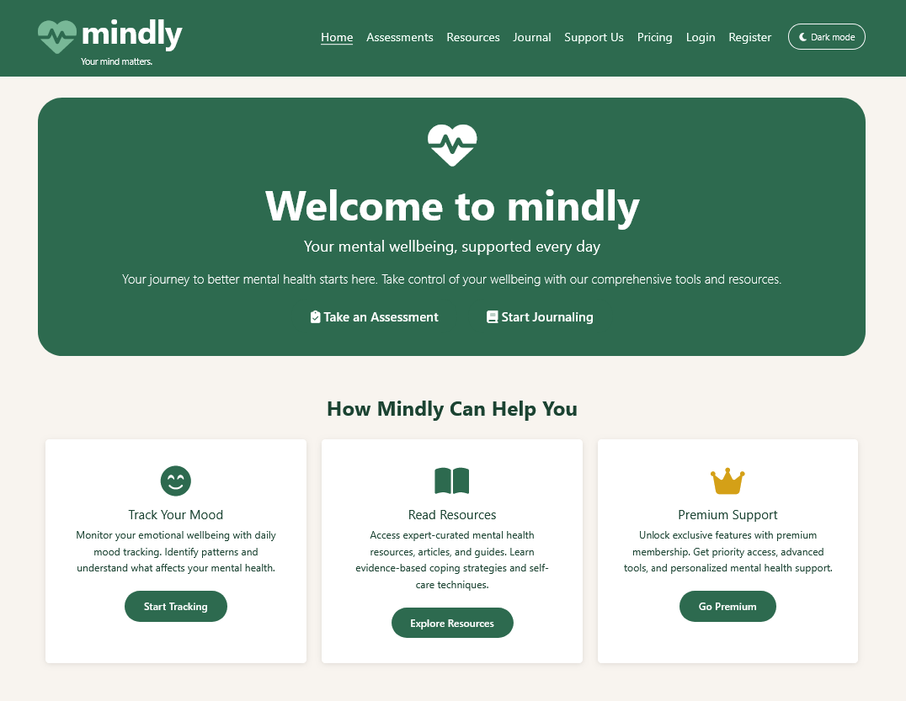

#### Dashboard Page
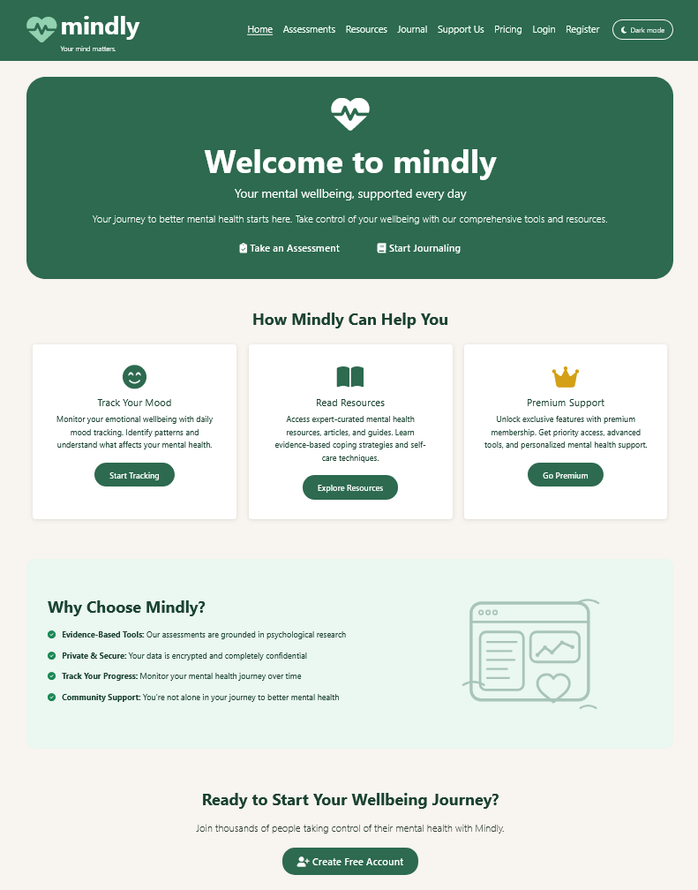

#### Journal Page
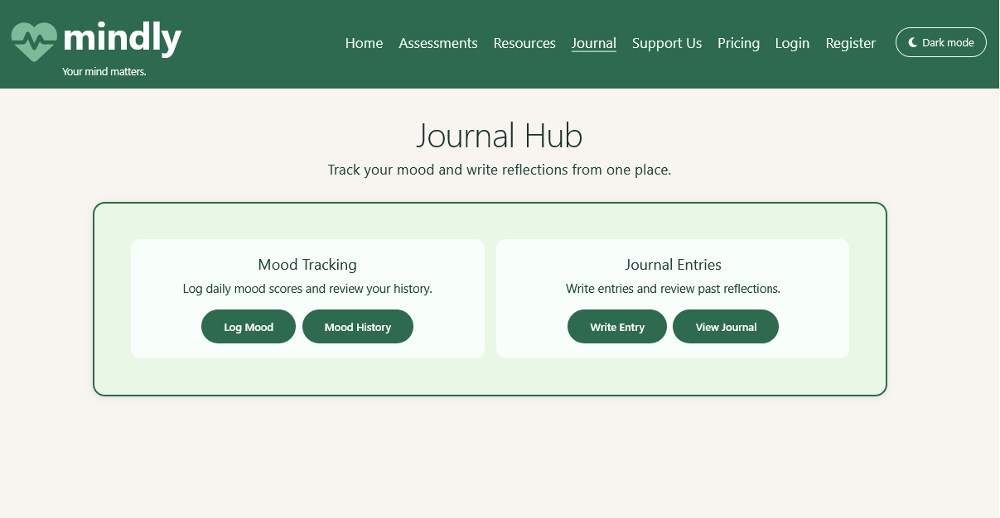

#### Mood Form Page
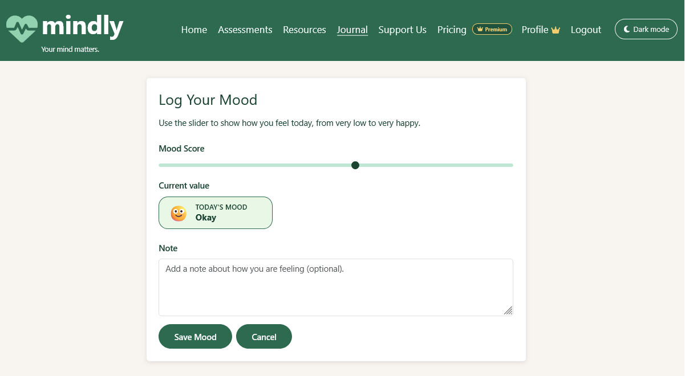

#### Pricing Page
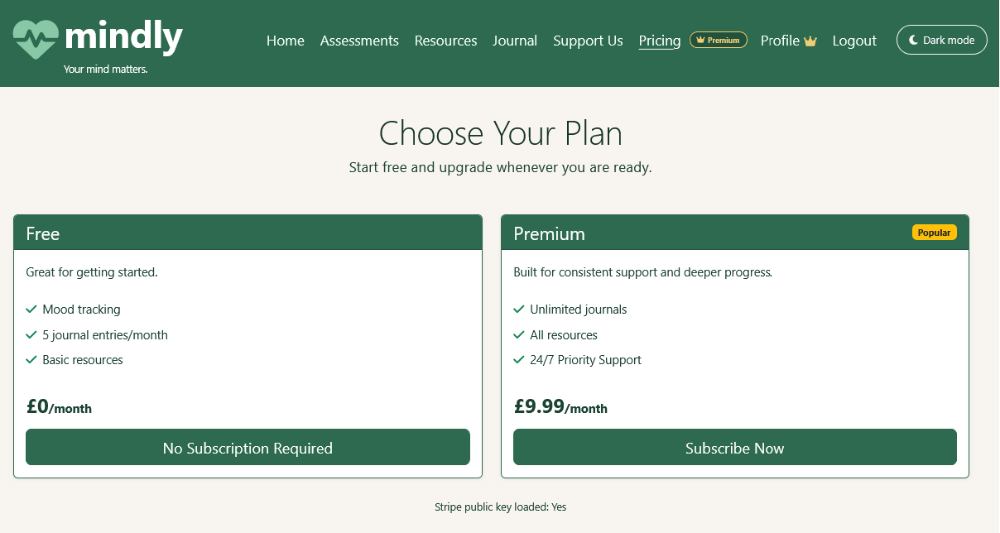

#### Premium Content Page
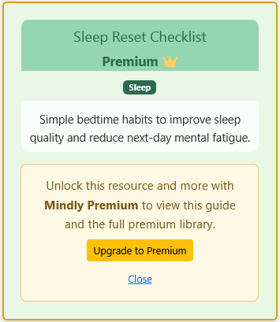

#### Payment Success Page
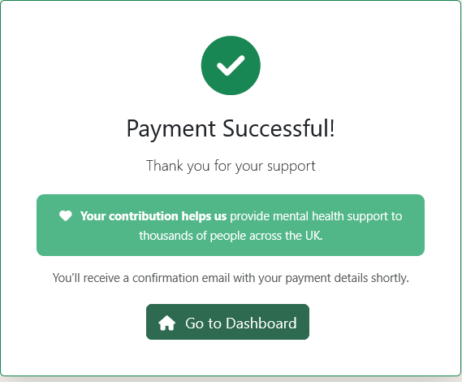

---

### **Error and Edge-Case Screenshots**

These screenshots demonstrate how Mindly handles error states and access-control boundaries.

#### 404 – Page Not Found
Navigating to an invalid URL displays Mindly's custom 404 error page.

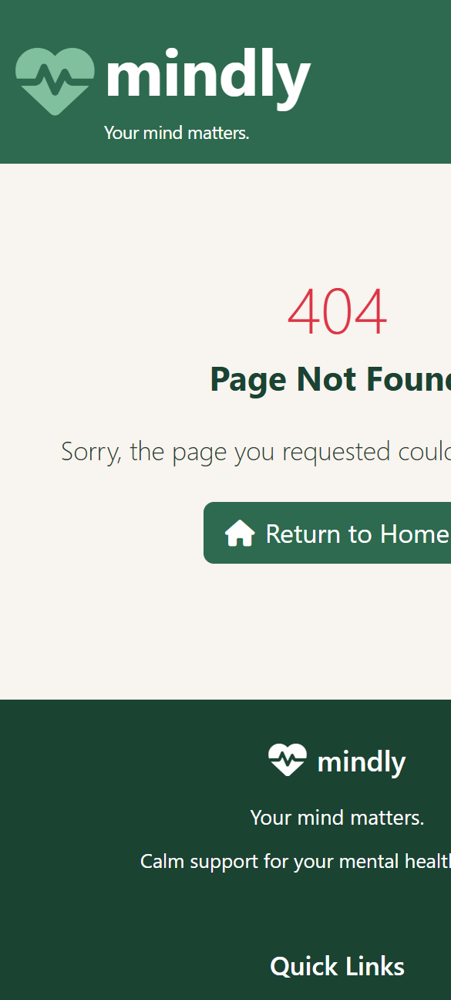

#### Stripe Checkout Error
An invalid or declined card triggers a clear error message on the Stripe checkout page.

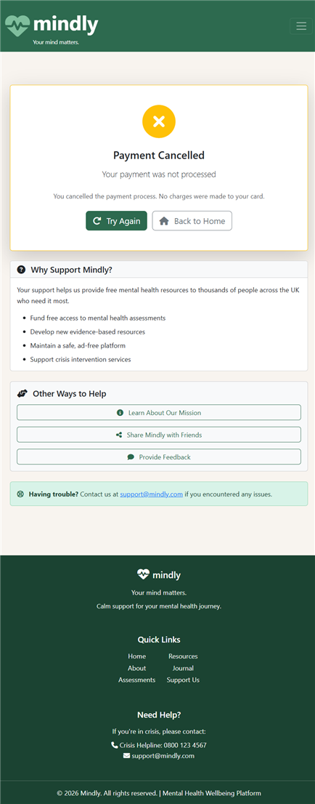

#### Premium Access Denied
A free-tier user attempting to access premium content is blocked and redirected with an appropriate message.

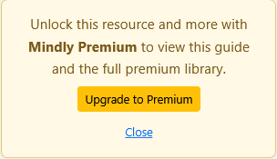

---

### **Repository**

[**GitHub Repository**](https://github.com/Shezmoin/Mindly)

---

### **Badges**

* **Django 4.2:** Backend framework
* **Python 3.13:** Core language
* **Bootstrap 5:** Responsive frontend
* **Stripe:** Payment processing
* **SQLite/PostgreSQL:** Relational database
* **Git & GitHub:** Version control
* **Deployed:** Ready for production

---

## **User Experience**

### **User Stories**

#### **Free User Story: Daily Mood Tracking**
* As a free user, I want to record my daily mood score (1-10) and write a short note, so that I can track my emotional wellbeing over time.

#### **Free User Story: Journal Writing**
* As a free user, I want to create and edit private journal entries, so that I can reflect on my thoughts and experiences.

#### **Free User Story: View History**
* As a free user, I want to view my past mood entries and journal entries, so that I can observe patterns and track my progress.

#### **Premium User Story: Premium Resources**
* As a premium subscriber, I want to access exclusive premium resources, so that I can benefit from advanced wellbeing tools and content.

---

### **First-time Users**

* As a first-time user, I want to understand the purpose of Mindly immediately upon landing.
* As a first-time user, I want a clear registration process that is simple and secure.
* As a first-time user, I want to navigate the application intuitively without confusion.
* As a first-time user, I want to see the application work seamlessly on mobile, tablet, and desktop.
* As a first-time user, I want clear information about the pricing model and premium tier benefits.

---

### **Returning Premium Users**

* As a returning user, I want to log in securely and access my personal data immediately.
* As a returning user, I want to create, edit, and delete my mood entries and journal entries.
* As a returning user, I want my data to remain private and accessible only to me.
* As a premium subscriber, I want to receive immediate access to premium features upon successful payment.
* As a premium subscriber, I want to manage my subscription and see my current tier status.

---

## **Design**

### **Wireframes and Planning**

This section is for the early wireframes used to plan the main pages before final styling and content were added. These wireframes show the intended layout, content structure, and key navigation areas for the main user journey.

#### **Home Page Wireframe**

This wireframe shows the landing page structure, including the welcome section, key call-to-action areas, and the main route into registration, login, and premium information.

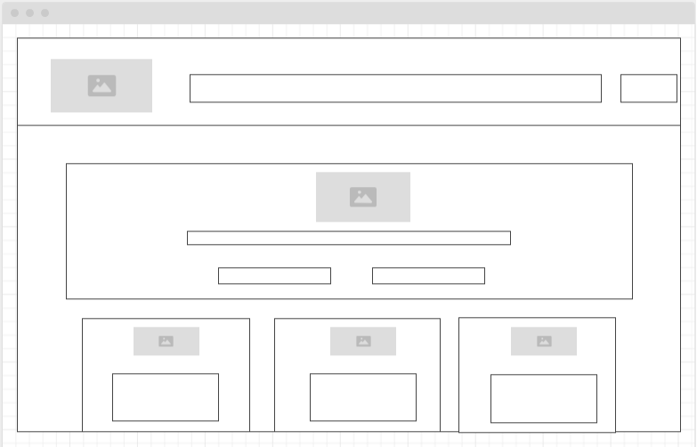

#### **Assessment Page Wireframe**

This wireframe shows the assessment page layout, with the question area, score or result area, and the clear action buttons used to submit and review the self-check.

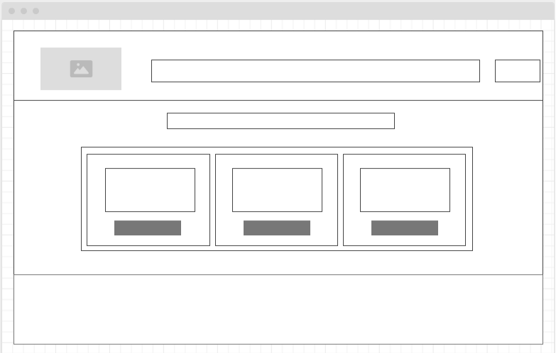

#### **Journal Page Wireframe**

This wireframe shows the structure planned for journal content, including entry listing, writing space, and the layout used to keep the page simple and easy to use.

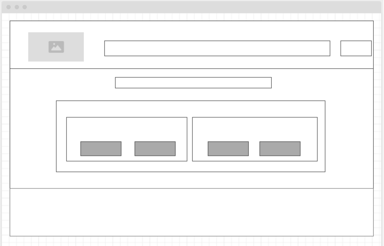

#### **Pricing Page Wireframe**

This wireframe shows the pricing page layout, including the free and premium comparison, subscription messaging, and the call-to-action area for upgrading.

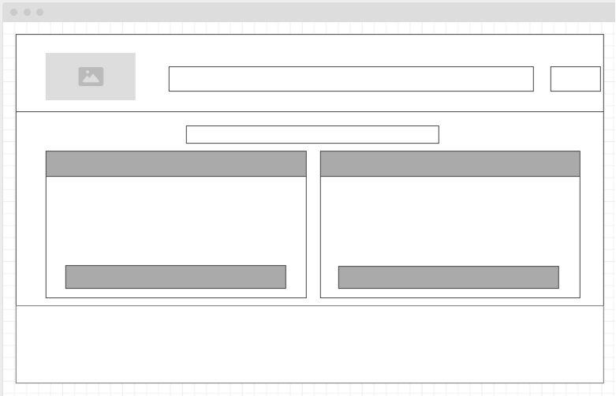

### **Wireframe to Final Changes**

- **Home page**: The final page keeps the same hero-first structure from the wireframe, but adds stronger visual hierarchy and clearer call-to-action styling.
- **Assessment page**: The final page keeps the same question-to-result flow, with clearer score feedback and supportive text for better readability.
- **Journal page**: The final page keeps the same create/list layout, with cleaner spacing and clearer action controls for create, edit, and delete.
- **Pricing page**: The final page keeps the same free-vs-premium comparison block, with clearer tier messaging and stronger upgrade button emphasis.

### **Design Overview**

Mindly is designed to be calm, supportive, and user-friendly. The interface prioritises clarity, accessibility, and ease of use to encourage consistent wellbeing tracking and journaling without overwhelming the user.

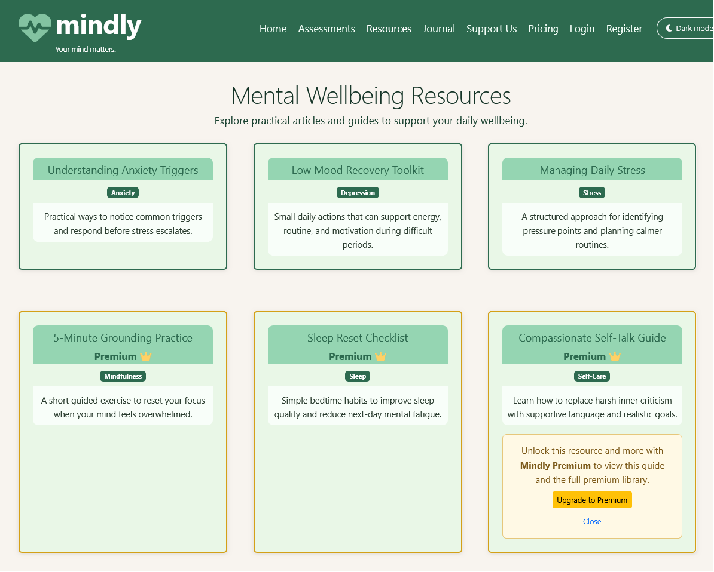

---

### **Colour Scheme**

A warm, supportive colour palette is chosen to create a positive, welcoming environment that encourages mental health reflection and action.

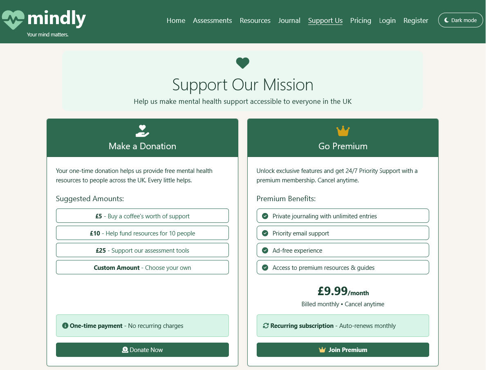

#### **Primary Colours:**


#### **Accent Colours:**


---

### **Typography**

* **Headings:** Clear, distinct hierarchy for easy navigation and readability.
* **Body Text:** Soft, approachable sans-serif for calm reading experience.
* **Font Family:** System fonts optimized for accessibility and performance.

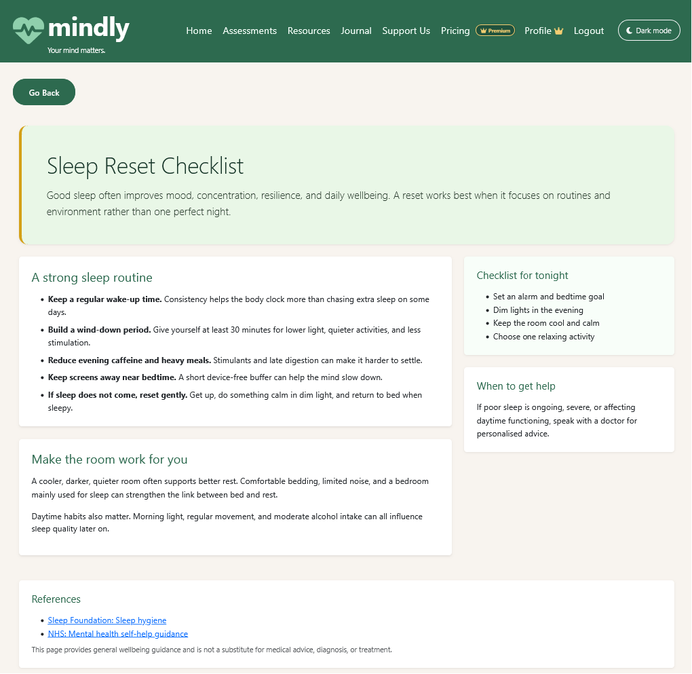

---

### **Accessibility in Design**

Mindly follows WCAG accessibility best practices:

* Semantic HTML used throughout for screen reader compatibility
* Labels associated with all form inputs for clarity
* Keyboard navigation supported for all interactive elements
* Sufficient colour contrast maintained (WCAG AA standard)
* Responsive design ensures usability on all device sizes
* Alt text provided for all non-decorative images
* Form validation provides clear error messages

---

## **Features**

### **All Pages Features**

* Responsive navigation bar with user status indicator
* Bootstrap-based responsive grid layout
* Clear visual hierarchy and consistent branding
* Mobile-optimized interface for all screen sizes
* Accessible form controls and labels
* User authentication status visible throughout
* Dark mode / Light mode toggle (persisted via localStorage)

### **Authentication Features**

* Secure user registration with username and email
* Username-based login with password verification
* Secure logout functionality
* Profile page for logged-in users with editable email and bio
* Premium users can cancel subscription from the profile page
* @login_required decorators on protected views
* CSRF protection on all forms

### **Mood Tracking Features**

* Create mood entries with score (1-10) and optional note
* View all past mood entries in reverse chronological order
* Edit mood entries to update score or note
* Delete mood entries with confirmation
* Mood entry metadata (date/time created)
* Monthly journal limit for free users is enforced and clearly communicated
* Responsive mood entry display across devices

### **Journal Features**

* Create full journal entries with title and body content
* Mark entries as private for personal use
* Edit journal entries to update content
* Delete journal entries with confirmation
* View all journal entries with summaries
* Search journal entries by title
* Timestamp tracking for entry creation/modification

### **Assessment Features**

* Dedicated assessment hub with interactive self-check tools
* Includes a Mood Self-Check, Stress Self-Check, and Sleep Habits Check
* Supportive results are displayed instantly after submission
* Assessment content is informational and not intended as a diagnosis

### **Premium Features**

### **Resource Library**

* Six professionally presented mental wellbeing resource pages are available in the platform.
* Free users can access Anxiety, Depression, and Stress guides.
* Premium users can additionally access Mindfulness, Sleep, and Self-Care guides.
* Each resource page includes structured wellbeing guidance and a reference section linking to reputable sources such as NHS, Mind, Sleep Foundation, and the Mental Health Foundation.

* Premium resources page (gated by subscription)
* Subscription tier stored securely in UserProfile
* @premium_required decorator enforces access control
* Premium users see subscription status on dashboard
* Automatic tier upgrade on successful payment

### **Payment Features**

* Stripe Checkout integration for secure payments
* Monthly recurring subscription at £9.99
* Subscription pricing page with Free/Premium comparison
* Payment success confirmation page
* Payment cancellation handling
* Webhook integration to auto-upgrade users
* Secure environment variable management for API keys

---

## **Future Features**
* Expand the resource library with clinician-reviewed articles and downloadable worksheets.
* Add searchable categories and saved favourites for premium users.
### **User Experience Improvements**

* Mood analytics with charts and trends
* Export entries as PDF or text files
* Email reminders for daily journaling
* Shareable mood statistics (with privacy controls)
* Notification system for premium content updates
* Social features (optional shared mood insights with consent)
* Profile editing (update bio and profile picture)

### **Premium Content Expansion**

* Video meditation guides
* Wellness articles and resources
* Guided reflection prompts
* Expert-authored wellbeing content
* Monthly wellness newsletter for premium users

### **Technical Enhancements**

* Advanced search and filtering
* Data backup and recovery features
* Two-factor authentication (2FA)
* API for mobile app development
* Payment method management for subscribers

---

## **Data Model and Schema**

Mindly uses one custom user model with a small set of linked profile, mood, journal, and assessment records.

### **Model Summary**

| Model | Key fields |
| --- | --- |
| `CustomUser` | `username`, `email`, `bio`, `profile_picture` |
| `UserProfile` | `user`, `subscription_tier`, `joined_date`, `reminder_time` |
| `MoodEntry` | `user`, `mood_score`, `note`, `created_at` |
| `JournalEntry` | `user`, `title`, `content`, `is_private`, `created_at`, `updated_at` |
| `AssessmentResult` | `user`, `assessment_type`, `q1_score` to `q4_score`, `total_score`, `level`, `created_at` |

### **Relationships**

- `CustomUser` → `UserProfile` (`1-to-1`)
- `CustomUser` → `MoodEntry` (`1-to-many`)
- `CustomUser` → `JournalEntry` (`1-to-many`)
- `CustomUser` → `AssessmentResult` (`1-to-many`)

### **ERD (ASCII)**

```text
CustomUser
  ├── UserProfile        (1-to-1)
  ├── MoodEntry          (1-to-many)
  ├── JournalEntry       (1-to-many)
  └── AssessmentResult   (1-to-many)
```

---

## **Backend-Frontend Flow Examples**

### **Flow 1: Journal CRUD (Create example)**

1. User submits the journal form in the template (`templates/journal/journal_form.html`)
2. POST request is handled by `journal_create_view` in `journal/views.py`
3. Django form validates inputs and binds the entry to `request.user`
4. ORM saves `JournalEntry` into the database
5. User is redirected to journal list with a success message
6. Template renders updated list using query results for that logged-in user only

### **Flow 2: Premium Upgrade via Stripe Webhook**

1. User starts checkout from pricing/support page
2. `payments/checkout_view` creates Stripe Checkout Session
3. Stripe sends `checkout.session.completed` event to `payments/webhook/`
4. Webhook verifies signature with `STRIPE_WEBHOOK_SECRET`
5. Matching user is identified from metadata/email
6. Only `mode=subscription` events upgrade `UserProfile.subscription_tier` to `premium`
7. Premium-protected views become accessible through the `@premium_required` gate

Fallback note: when a user returns to `payments/success/` with `session_id`,
`success_view` also confirms Stripe session state and applies the premium upgrade
if required.

### **Sequence Diagram: Premium Upgrade Request-Response Path**

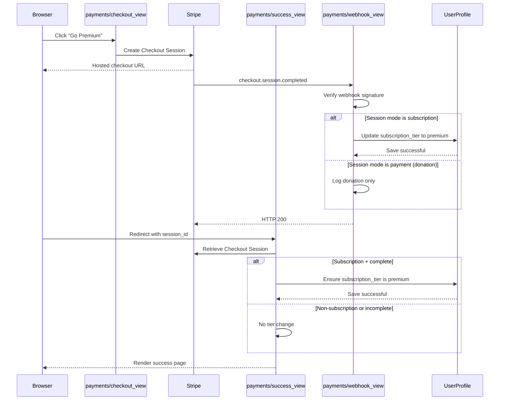

---

## **Mindly Project Structure**

```
mindly/
├── manage.py                           # Django management script
├── Procfile                            # Heroku process declaration
├── .python-version                     # Runtime Python version pin
├── .flake8                             # Linting configuration
├── requirements.txt                    # Python dependencies
├── README.md                           # Project documentation
├── .env                                # Environment variables (local, not committed)
├── .env.example                        # Environment variable template
├── .gitignore                          # Git ignore file
├── mindly/                             # Project settings
│   ├── settings.py                     # Django configuration
│   ├── urls.py                         # Root URL router
│   ├── wsgi.py                         # WSGI application
│   └── asgi.py                         # ASGI application
├── users/                              # Authentication & profile app
│   ├── models.py                       # CustomUser, UserProfile models
│   ├── views.py                        # Auth views (register/login/logout), profile edit, premium cancellation
│   ├── urls.py                         # User URLs
│   ├── decorators.py                   # @premium_required decorator
│   ├── tests.py                        # User model tests
│   ├── forms.py                        # Auth forms
│   └── templates/users/                # User templates
├── journal/                            # Journal app
│   ├── models.py                       # JournalEntry and MoodEntry models
│   ├── views.py                        # Journal and mood CRUD views
│   ├── urls.py                         # Journal URLs
│   ├── tests.py                        # Journal tests
│   └── templates/journal/              # Journal templates
├── assessments/                        # Assessment self-check tools
│   ├── models.py                       # AssessmentResult model for persisted self-check submissions
│   ├── views.py                        # Mood/stress/sleep self-check logic
│   ├── urls.py                         # Assessment URLs
│   └── tests.py                        # Assessment tests
├── payments/                           # Payments & subscription
│   ├── models.py                       # Payment models (minimal)
│   ├── views.py                        # Stripe checkout, success recovery, webhook
│   ├── urls.py                         # Payment URLs
│   ├── tests.py                        # Payment tests
│   └── templates/payments/             # Pricing, checkout, success/cancel/error pages
├── pages/                              # Static pages & premium resources
│   ├── views.py                        # Home/about/dashboard, resources, premium resources
│   ├── urls.py                         # Static page URLs
│   ├── tests.py                        # Page tests
│   └── templates/pages/                # Page templates
├── templates/                          # Project-level templates
│   ├── base.html                       # Base template & navbar
│   ├── pages/                          # Home, dashboard, resources
│   ├── journal/                        # Journal & mood entry templates
│   ├── payments/                       # Pricing, checkout, success pages
│   └── users/                          # Register, login, profile templates
├── static/                             # Static files
│   └── css/
│       └── style.css                   # Custom styles
├── docs/                               # Documentation
│   ├── TESTING.md                      # Testing documentation
│   ├── DEPLOYMENT.md                   # Deployment guide
│   └── ERROR_LOG.md                    # Error log with fixes
├── errors/                             # Error capture logs and session records
│   └── README.md                       # Error notes
└── docs/screenshots/                   # Evidence screenshots used in documentation
```

---

## **App Structure Justification**

Each Django app in Mindly has a single, well-defined domain responsibility. The table below explains why each boundary was drawn where it was.

| App | Domain | Reason for boundary |
|-----|---------|---------------------|
| `users` | Authentication, profiles, premium state | Handles all identity concerns independently so auth logic never leaks into feature apps |
| `journal` | Journal entries and mood tracking | Groups related CRUD models (`JournalEntry`, `MoodEntry`) under one owner-scoped domain |
| `assessments` | Guided self-check tools and result persistence | Isolated so self-check scoring and result history can evolve without touching journal or payment logic |
| `payments` | Stripe checkout, webhooks, subscription management | Payment concerns are sensitive and externally integrated — strict isolation reduces risk and simplifies testing |
| `pages` | Static pages, dashboard, public and premium resources | Thin presentation layer; separating it keeps feature apps free of generic page routing |

Cross-app communication is handled exclusively through model relationships and Django's URL routing. No app imports another app's views directly, preserving clean separation of concerns.

---

## **Technologies Used**

### **Languages Used**

* Python 3.13
* HTML5
* CSS3
* JavaScript

### **Frameworks, Libraries & Tools**

* **Django 4.2** - Backend web framework
* **django-crispy-forms** - Cleaner and consistent Django form rendering
* **crispy-bootstrap5** - Bootstrap 5 template pack for crispy forms
* **Bootstrap 5** - Responsive CSS framework
* **SQLite** - Development database
* **PostgreSQL (Heroku)** - Production relational database
* **dj-database-url** - Database URL parsing for environment-based config
* **psycopg2-binary** - PostgreSQL adapter used by Django on Heroku
* **Stripe** - Payment processing
* **Python Decouple** - Environment variable management
* **WhiteNoise** - Static file serving in production
* **Gunicorn** - Production WSGI HTTP server for Django
* **Pillow** - Image processing support for profile image uploads
* **Git & GitHub** - Version control
* **Windows/CMD** - Development environment
* **VS Code** - Code editor

### **Current Status Note**

Core application functionality is implemented and actively tested. Heroku deployment, PostgreSQL setup, Stripe webhook delivery, and production verification checks have been completed.

---

## **Testing**

Comprehensive testing has been carried out to ensure functionality, security, usability, and reliability across all features.

Automated Django test modules are maintained across the main apps (`users`, `journal`, `payments`, `pages`, `assessments`) and are run with `python manage.py test` as part of routine verification.

### **Python Validation**

Python checked with flake8.

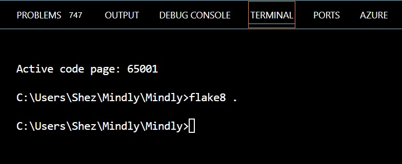

* No critical errors
* Proper syntax and structure
* No unused variables/imports

See [**TESTING.md**](./docs/TESTING.md) for full testing documentation including:

* Automated test coverage summary
* Manual test matrix (MT-01 to MT-11): [Jump to manual test table](./docs/TESTING.md#manual-test-matrix-mt-01-to-mt-11)

* Testing strategy and methodology
* User story validation
* Feature testing (CRUD, payments, authentication)
* Form validation testing
* Browser compatibility testing
* Responsiveness testing
* Accessibility testing (WCAG 2.1 AA/AAA contrast verification; see [ACCESSIBILITY.md](./docs/ACCESSIBILITY.md) for the 8.08:1 contrast ratio used in the navbar)
* Security testing
* Lighthouse performance scores
* Code validation (PEP8, HTML, CSS, JavaScript)
* Known issues (if any)

### **Requirement to Evidence Map**

| Requirement Area | Where Implemented | Evidence |
|----------|-----------|----------|
| Authentication and access control | `users/views.py`, `users/decorators.py`, `users/tests.py` | [docs/TESTING.md](./docs/TESTING.md), [docs/ERROR_LOG.md](./docs/ERROR_LOG.md) |
| Full CRUD for user-owned data | `journal/views.py`, `journal/forms.py`, `journal/tests.py` | [docs/TESTING.md](./docs/TESTING.md) |
| Relational data model | `users/models.py`, `journal/models.py`, `assessments/models.py` | Data Model section in README |
| Payment and subscription lifecycle | `payments/views.py`, `payments/tests.py` | [docs/TESTING.md](./docs/TESTING.md), Stripe Integration section |
| Robust error handling | `payments/views.py`, custom `404.html` and `500.html` templates | [docs/ERROR_LOG.md](./docs/ERROR_LOG.md) |
| Deployment readiness | `Procfile`, environment config, static handling | [docs/DEPLOYMENT.md](./docs/DEPLOYMENT.md) |

### **Final Verification Summary**

All non-cleanup verification checks were completed and recorded before submission finalization.

* Authentication checks completed (valid login, invalid login handling, logout flow)
* Profile and owner-scoped feature checks completed (profile update persistence, journal and mood owner scope)
* Payment and subscription checks completed (Stripe checkout flow, cancellation path, webhook confirmation at `200 OK`)
* Error-state checks completed (custom 404 and checkout failure behavior)
* UI validation checks completed (responsive checks, dark mode checks, consistency/robustness sweeps)
* Deployment and platform checks completed (Heroku health/config checks and PostgreSQL verification)

---

## **Errors**

All errors encountered during development have been documented with investigations and solutions.

See [**ERROR_LOG.md**](./docs/ERROR_LOG.md) for complete error documentation including:

* Error description and symptoms
* Investigation methodology
* Solution applied
* Screenshots/evidence
* Current status (resolved/workaround)

---

## **Deployment**

Mindly is deployed following professional security and deployment practices.

See [**DEPLOYMENT.md**](docs/DEPLOYMENT.md) for comprehensive deployment documentation including:

* Local development setup
* Production deployment on Heroku (step-by-step)
* Environment variable configuration (Heroku config vars)
* Database setup and migrations
* Debug mode management
* Secret key management
* Stripe keys configuration
* Deployment verification steps
* Troubleshooting guide

For Heroku setup from scratch, follow the numbered production steps in [**DEPLOYMENT.md - Production Deployment (Heroku)**](./docs/DEPLOYMENT.md#production-deployment-heroku).

---

## **Security**

Security controls are implemented in both code and deployment configuration:

* **Environment variables**: Sensitive values are loaded from environment variables (`SECRET_KEY`, `DEBUG`, `ALLOWED_HOSTS`, Stripe keys, webhook secret)
* **Production debug policy**: `DEBUG=False` is required for production deployments
* **CSRF protection**: Django CSRF middleware is enabled and form submissions use CSRF tokens
* **Stripe webhook verification**: Webhook signatures are verified with `STRIPE_WEBHOOK_SECRET` before processing events
* **Transport/session hardening**: HTTPS redirect, secure cookies, and HSTS are enabled when `DEBUG=False`

---

## **Stripe Integration**

### **Payment Architecture**

1. **Checkout Flow:** User clicks "Subscribe Now" → Django creates Stripe Checkout Session → Stripe hosts secure payment page
2. **Payment Processing:** Stripe processes card securely
3. **Webhook Flow:** Stripe sends checkout.session.completed event → Webhook view verifies signature → User profile upgraded to premium tier
4. **Access Control:** @premium_required decorator gates premium views

### **Security Features**

* API keys stored in environment variables (never hardcoded)
* Webhook signature verification with STRIPE_WEBHOOK_SECRET
* CSRF protection on all forms
* @login_required on sensitive endpoints
* Custom @premium_required decorator for tier verification
* Debug mode disabled in production

### **Error Handling & Recovery**

| Scenario | Behaviour |
|----------|-----------|
| User cancels at Stripe checkout | Redirected to `payments/cancel/` — subscription is **not** created, account unchanged |
| Stripe checkout fails (card declined, etc.) | Stripe shows an in-page error on the hosted checkout; user can retry or exit |
| User exits checkout without completing | Session expires; `checkout.session.completed` is never fired; no upgrade occurs |
| Webhook receives unexpected event type | Handler returns `200 OK` silently — only `checkout.session.completed` triggers upgrade logic |
| Webhook signature verification fails | Returns `400 Bad Request`; event is discarded without processing |
| `checkout.session.completed` has no email | Falls back to metadata `user_id`; if no user matches, no upgrade and warning is logged |
| Donation payment (one-time) received | Webhook detects `mode != subscription`; marks donation only — premium tier is **not** set |
| User reaches `/payments/success/` without a valid session | View renders success page but only applies premium upgrade when a valid subscription session can be confirmed |
| Custom 404 page | Served by `templates/404.html` when `DEBUG=False` and a route is not found |
| Custom 500 page | Served by `templates/500.html` when `DEBUG=False` and an unhandled exception occurs |

### **Local Webhook Testing**

```bash
stripe login
stripe listen --forward-to 127.0.0.1:8000/payments/webhook/
```

See [**DEPLOYMENT.md**](./docs/DEPLOYMENT.md) for complete Stripe setup and testing instructions.

---

## **Accessibility**

Mindly adheres to WCAG 2.1 AA accessibility standards:

* **Semantic HTML** - Proper heading hierarchy, nav landmarks, section organization
* **Form Accessibility** - Labels linked to inputs, error messages clear and associated
* **Keyboard Navigation** - All interactive elements accessible via Tab/Enter/Spacebar
* **Colour Contrast** - Text meets WCAG AA minimum (4.5:1 for body text)
* **Responsive Design** - Works at all viewport sizes from 320px upward
* **Screen Reader Compatibility** - Semantic markup ensures screen reader usability
* **Focus Management** - Visible focus indicators on all interactive elements

---

## **Originality Statement**

Mindly is an independently designed and implemented project. It is not based on a Code Institute walkthrough or any tutorial project. Specific choices that distinguish it:

- **Domain**: Mental wellness tracking with self-assessment tools, premium content gating, and a recurring subscription model — not a blog, e-commerce store, or social network.
- **Data model**: Five custom models across five apps (`CustomUser`/`UserProfile`, `JournalEntry`, `MoodEntry`, `AssessmentResult`, and payment state on `UserProfile`), with owner-scoped queries throughout.
- **Stripe integration**: Full Checkout and Webhook lifecycle built from first principles against the Stripe Python SDK, including donation vs. subscription differentiation in the webhook handler, session-based success recovery, and premium cancellation through the Django user model.
- **UX decisions**: Dark mode toggle with `localStorage` persistence, per-question scoring in assessments with band-based feedback, premium content chip badges, and a custom `@premium_required` decorator — none of these patterns appear in standard CI walkthroughs.
- **Testing**: Structured coverage across CRUD, authentication guards, and Stripe edge cases (missing signatures, invalid payloads, debug fallback paths) using Django's `TestCase` and `unittest.mock`.

---

## **Credits and Acknowledgements**

### **Code**

Python documentation, Django official documentation, Stripe API documentation, Bootstrap documentation, and Django best practices from community sources.

### **Media**

Project screenshots are embedded in this README. Remaining visual evidence screenshots (testing/validation/audit) are tracked in [docs/TESTING.md](docs/TESTING.md).

### **Acknowledgements**

I am very grateful to my wife and my family for their full support throughout my challenging health condition. Their encouragement and patience helped me keep moving forward during difficult periods.

I am especially grateful to my tutor, Manuel Perez, for his extraordinary support, guidance, and understanding of my health situation and physical limitations. This project would not have been possible without that support.

I am also thankful for the free educational material available on YouTube, which helped me clear up confusion and gave me helpful ideas and inspiration during this journey.

---

## **Known Bugs**

No confirmed functional bugs are currently open in production-critical flows.

---

**Shehzad Moin, 2026**
