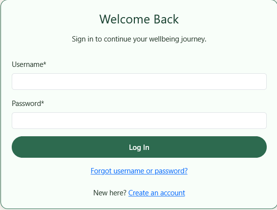
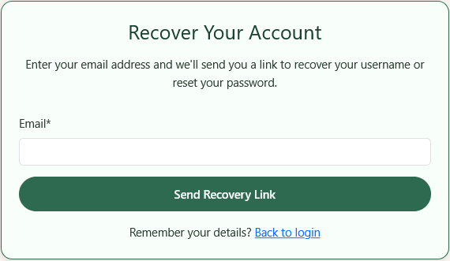
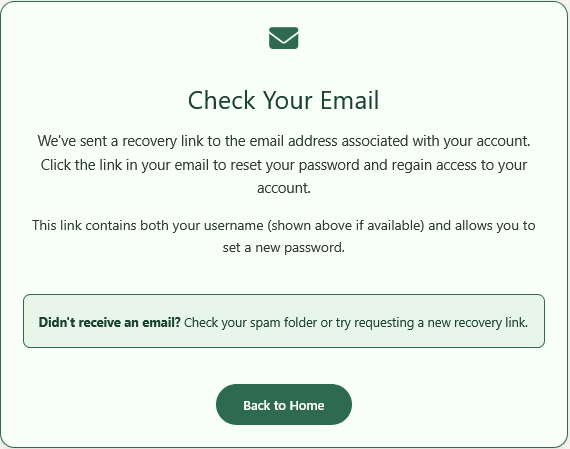
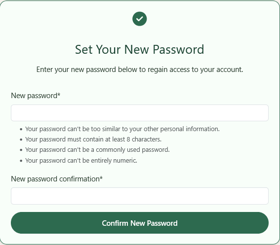
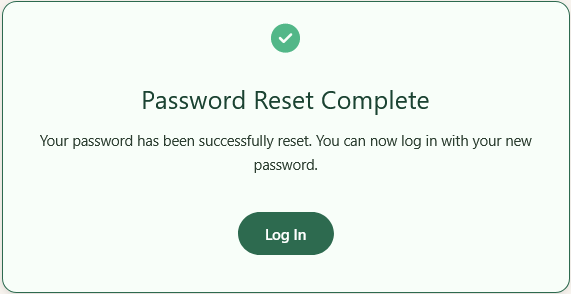
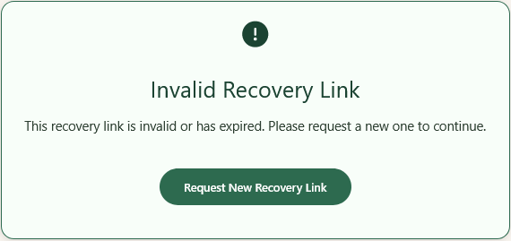

# Testing Guide - Mindly Mental Health Platform

## Test Overview

This document covers manual testing procedures for all Mindly features, with special emphasis on the **account recovery** functionality (username + password reset).

---

## Test Environment Setup

### Local Testing
```bash
python manage.py runserver
# Navigate to http://127.0.0.1:8000/
```

### Development Email Backend
Emails print to console instead of being sent. Check terminal output for email content when testing account recovery.

### Create Test User
```bash
python manage.py createsuperuser
# Username: testuser
# Email: test@example.com
# Password: TestPassword123!
```

---

## Authentication Testing

### Test AT-01: User Registration
**Objective:** Verify new user can register successfully

1. Navigate to home page
2. Click "Sign Up" or "Create an account"
3. Enter:
   - Username: `newuser123`
   - Email: `newuser@example.com`
   - Password: `SecurePass123!`
   - Confirm Password: `SecurePass123!`
4. Click "Create Account"
5. **Expected:** Redirected to registration success page with message

### Test AT-02: User Login
**Objective:** Verify registered user can log in

1. Navigate to `/users/login/`
2. Enter credentials:
   - Username: `newuser123`
   - Password: `SecurePass123!`
3. Click "Log In"
4. **Expected:** Logged in, redirected to home or dashboard

### Test AT-03: User Logout
**Objective:** Verify user can log out

1. While logged in, navigate to any page
2. Click "Logout" in navigation bar
3. **Expected:** Logged out, session cleared, redirected to home

### Test AT-04: Invalid Login
**Objective:** Verify system rejects incorrect credentials

1. Navigate to `/users/login/`
2. Enter:
   - Username: `testuser`
   - Password: `WrongPassword`
3. Click "Log In"
4. **Expected:** Error message displayed, still on login page

---

## Account Recovery Testing

### Test AR-01: Account Recovery - Request Form
**Objective:** Verify account recovery request page loads and displays correctly

1. Navigate to `/users/login/`
2. **Expected:** "Forgot username or password?" link is visible (below Log In button)
   - 
3. Click the link
4. **Expected:** Redirected to `/users/password-reset/` with:
   - Heading: "Recover Your Account"
   - Description text: "Enter the email address associated with your account. We'll send you a link to recover your username or reset your password."
   - Email input field
   - "Send Recovery Link" button
   - "Back to login" link
   - Mindly styling (forest green colours, card panel)
   - 

### Test AR-02: Account Recovery - Email Submission & Username Display
**Objective:** Verify email submission triggers recovery email and shows confirmation page with username

1. Complete Test AR-01
2. Enter email: `test@example.com` (must be registered account)
3. Click "Send Recovery Link"
4. **Expected:**
   - Redirected to `/users/password-reset/done/`
   - Page displays: "Check Your Email"
   - **Username displayed in code box** (new feature - shows "Your username: testuser")
   - Envelope icon (green)
   - Message about checking email and mentions username in the link
   - "Back to Home" button
   - Mindly styling applied
   - 

### Test AR-03: Account Recovery - Email Content (Development)
**Objective:** Verify recovery email contains correct information

**In Development (Console Backend):**
1. Complete Test AR-02
2. Check terminal output for email content
3. **Expected:** Email contains:
   - Subject: something like "Password reset on..."
   - Recovery link with token: `/users/password-reset/<uidb64>/<token>/`
   - Expiry notice (1 hour)
   - Instructions to ignore if didn't request
   - Note about username and password reset capability

### Test AR-04: Account Recovery - Non-existent Email
**Objective:** Verify system accepts non-existent emails gracefully (security)

1. Navigate to `/users/password-reset/`
2. Enter email: `nonexistent@example.com` (not registered)
3. Click "Send Recovery Link"
4. **Expected:** Still shows "Check Your Email" page (for security, doesn't reveal if email exists or not)

### Test AR-05: Account Recovery - Valid Token Form
**Objective:** Verify recovery link with valid token shows password form

**Setup:**
1. Complete Test AR-02 (email confirmation page with username)
2. Copy recovery link from console output (development) or email (production)
3. Paste link in new browser tab

**Test:**
1. Navigate to recovery link: `/users/password-reset/<uidb64>/<token>/`
2. **Expected:**
   - Page loads: "Set Your New Password"
   - **Green check-circle icon** at top (new feature)
   - Password input fields
   - Password strength/requirements shown
   - "Confirm New Password" button (updated label)
   - "Back to login" link
   - Mindly styling applied
   - 

### Test AR-06: Account Recovery - Form Submission
**Objective:** Verify new password is set successfully

1. Complete Test AR-05 (valid token page)
2. Enter:
   - New Password: `NewSecurePass456!`
   - Confirm Password: `NewSecurePass456!`
3. Click "Confirm New Password"
4. **Expected:**
   - Redirected to `/users/password-reset/complete/`
   - Page displays: "Password Successfully Reset"
   - Green check-circle icon
   - Success message
   - "Back to Login" button
   - Mindly styling applied
   - 

### Test AR-07: Account Recovery - Login with Recovered Credentials
**Objective:** Verify user can log in with recovered username and new password

1. Navigate to `/users/login/`
2. Enter (using username from confirmation page):
   - Username: `test` (from confirmation email/page)
   - Password: `NewSecurePass456!`
3. Click "Log In"
4. **Expected:** Successfully logged in, redirected to home/dashboard

### Test AR-08: Account Recovery - Expired Token
**Objective:** Verify system rejects expired recovery tokens

**Setup:**
1. Wait 1 hour after requesting account recovery OR
2. Manually modify token in URL (e.g., change last character)
3. Navigate to recovery link with expired/invalid token

**Test:**
1. Access `/users/password-reset/<uidb64>/<expired-token>/`
2. **Expected:**
   - Page loads with error message
   - **Red exclamation-circle icon** (new feature)
   - "Invalid Recovery Link" (updated message from "Invalid Reset Link")
   - "This recovery link is invalid or has expired. Please request a new one to continue."
   - "Request New Recovery Link" button (updated label)
   - Mindly styling applied
   - Form NOT displayed
   - 

### Test AR-09: Account Recovery - Form Validation
**Objective:** Verify password form validates input properly

1. Complete Test AR-05 (valid token page)
2. Try submitting with:
   - Empty fields → **Expected:** Error "This field is required"
   - Mismatched passwords → **Expected:** Error "The two password fields didn't match"
   - Too short password → **Expected:** Error if minimum length requirement
3. **Expected:** Form stays on same page, errors displayed in red

---

## Core Feature Testing

### Test MO-01: Create Mood Entry
**Objective:** Verify mood entry creation works

1. Log in as test user
2. Navigate to Mood Tracking
3. Select mood score (1-10)
4. Add optional note
5. Click "Save Mood"
6. **Expected:** Entry saved, appears in list with timestamp

### Test JO-01: Create Journal Entry
**Objective:** Verify journal entry creation works

1. Log in as test user
2. Navigate to Journal
3. Click "New Entry"
4. Enter:
   - Title: "Test Entry"
   - Content: "Test content here"
   - Privacy: Select "Private" or "Public"
5. Click "Save Entry"
6. **Expected:** Entry saved, appears in journal list

### Test JO-02: Edit Journal Entry
**Objective:** Verify journal entry editing works

1. Log in, navigate to Journal
2. Click on an existing entry
3. Click "Edit"
4. Change content
5. Click "Save"
6. **Expected:** Changes saved, timestamp updated

### Test JO-03: Delete Journal Entry
**Objective:** Verify journal entry deletion works

1. Log in, navigate to Journal
2. Click on an entry
3. Click "Delete"
4. Confirm deletion
5. **Expected:** Entry removed from list

### Test AS-01: Complete Assessment
**Objective:** Verify assessment submission and results display

1. Log in, navigate to Assessments
2. Select an assessment (e.g., "Mood Self-Check")
3. Answer all questions
4. Click "Submit"
5. **Expected:**
   - Results page displays with score
   - Supportive message
   - Recommendation text
   - Option to view another assessment or go home

---

## Payment Testing

### Test PM-01: View Pricing Page
**Objective:** Verify pricing page displays correctly

1. Navigate to `/payments/` or pricing link
2. **Expected:**
   - Free tier box displays
   - Premium tier box displays
   - Features comparison visible
   - "Upgrade to Premium" button shown
   - Pricing £9.99/month displayed

### Test PM-02: Stripe Checkout (Development)
**Objective:** Verify Stripe checkout form loads

1. Log in as test user
2. Click "Upgrade to Premium" or "Upgrade" button
3. **Expected:** Stripe Checkout form loads with:
   - Amount: £9.99
   - Email pre-filled
   - Card input field
   - "Pay" button

### Test PM-03: Stripe Test Payment
**Objective:** Verify successful test payment processing

1. Complete Test PM-02
2. Enter Stripe test card: `4242 4242 4242 4242`
3. Expiry: `12/25` or any future date
4. CVC: `123` or any 3 digits
5. Name: Any name
6. Click "Pay"
7. **Expected:**
   - Redirected to payment success page
   - Message: "Payment successful"
   - Premium features now accessible
   - User profile shows "Premium" tier

### Test PM-04: Stripe Declined Card
**Objective:** Verify error handling for declined cards

1. Complete Test PM-02
2. Enter Stripe test card (declined): `4000 0000 0000 0002`
3. Fill other details
4. Click "Pay"
5. **Expected:**
   - Error message displayed
   - "Your card was declined" message
   - Option to try again or contact support
   - Checkout form still visible for retry

---

## Profile Testing

### Test PR-01: View Profile
**Objective:** Verify profile page displays user information

1. Log in as test user
2. Click profile icon or navigate to `/users/profile/`
3. **Expected:**
   - Username displayed
   - Email displayed
   - Bio displayed (if set)
   - "Edit Profile" button visible
   - Subscription tier shown
   - "Cancel Premium" button visible (if premium)

### Test PR-02: Edit Profile
**Objective:** Verify profile editing works

1. Complete Test PR-01
2. Click "Edit Profile"
3. Update:
   - Bio: "New bio text"
   - Email: "newemail@example.com"
4. Click "Save"
5. **Expected:** Changes saved, profile page updated

---

## Security Testing

### Test SEC-01: CSRF Protection
**Objective:** Verify CSRF token protection on forms

1. Any form submission should have ``
2. Inspect page source and confirm token present
3. **Expected:** Token visible in form

### Test SEC-02: Login Required Protection
**Objective:** Verify protected pages require authentication

1. Log out
2. Try accessing `/journal/` or other protected page
3. **Expected:** Redirected to login page

### Test SEC-03: Premium Content Access
**Objective:** Verify free users can't access premium content

1. Log in as free user
2. Try accessing premium resource: `/resources/mindfulness/`
3. **Expected:** Access denied, redirected with message

---

## Error & Edge-Case Screenshots

These screenshots demonstrate how Mindly handles error states and access-control boundaries.

### 404 – Page Not Found
Navigating to an invalid URL displays Mindly's custom 404 error page.


### Stripe Checkout Error
An invalid or declined card triggers a clear error message on the Stripe checkout page.


### Premium Access Denied
A free-tier user attempting to access premium content is blocked and redirected with an appropriate message.


---

## Responsive Design Testing

### Test RD-01: Mobile View
**Objective:** Verify site works on mobile devices

1. Open browser DevTools (F12)
2. Toggle Device Toolbar (Ctrl+Shift+M)
3. Test on iPhone 12 (390x844)
4. **Expected:**
   - Navigation collapses to hamburger menu
   - All content visible and readable
   - Forms stack vertically
   - Buttons appropriately sized

### Test RD-02: Tablet View
**Objective:** Verify site works on tablets

1. Open DevTools, toggle Device Toolbar
2. Test on iPad (768x1024)
3. **Expected:**
   - Navigation visible
   - 2-column layouts adapt to screen
   - Content readable without horizontal scroll

### Test RD-03: Desktop View
**Objective:** Verify site works on desktop

1. Test at 1920x1080 resolution
2. **Expected:**
   - Multi-column layouts display
   - All content properly aligned
   - No horizontal scrolling needed

---

## Test Data Cleanup

After testing, clean up test data:
```bash
python manage.py shell
# Delete test user and associated data
from users.models import CustomUser
user = CustomUser.objects.get(username='testuser')
user.delete()
```

---

## Test Results Template

### Test Result Entry
```
Test ID: AT-01
Name: User Registration
Status: [PASS/FAIL]
Notes: [Any observations, errors, or issues]
Date: [Date tested]
Tester: [Your name]
```

---

## Regression Testing Checklist

Before each deployment, verify:
- [ ] User registration works
- [ ] User login works
- [ ] Account recovery flow works end-to-end (username + password reset)
- [ ] Mood entries create/read/update/delete
- [ ] Journal entries create/read/update/delete
- [ ] Assessments display and submit
- [ ] Premium payment processes
- [ ] Premium content is gated
- [ ] Profile editing works
- [ ] Mobile responsive
- [ ] All links work (404 checking)
- [ ] No console errors (F12)

---

## Known Issues & Limitations

1. **Email in Development:** Prints to console, not sent
2. **Recovery Token:** Expires after 1 hour (used for both username recovery and password reset)
3. **Free User Limits:** Monthly journal entries limited
4. **Premium Gating:** Some resources only for premium users

---

## Support & Contact

For test result discrepancies or bugs found, document:
- Steps to reproduce
- Expected vs. actual result
- Screenshots (if applicable)
- Browser/OS info
- Timestamp
