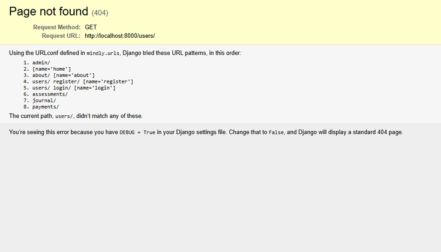

## Error Log - Mindly Application

This is the single source of truth for development errors, investigation notes, visual evidence, and resolutions. All 11 errors identified during development have been resolved and verified.

**Scope:** Development-time infrastructure, routing, template, environment, and validation issues discovered while building the application.

---

## Table of Contents

### Stage 1: Core Routing and Template Setup
- [Error 1: Users App Root Route Returns 404](#error-1-users-app-root-route-returns-404)
- [Error 2: Assessments Template Does Not Exist (500)](#error-2-assessments-template-does-not-exist-500)
- [Error 3: Journal Template Does Not Exist (500)](#error-3-journal-template-does-not-exist-500)

### Stage 2: Payment Flow and Webhook Integration
- [Error 4: Legacy Subscribe Path Showed Placeholder Message](#error-4-legacy-subscribe-path-showed-placeholder-message)
- [Error 5: Webhook Returning 400 on Stripe Events](#error-5-webhook-returning-400-on-stripe-events)
- [Error 6: Missing Robust Payload/JSON Handling in Webhook](#error-6-missing-robust-payloadjson-handling-in-webhook)
- [Error 7: Updated .env Values Not Applied Until Django Restart](#error-7-updated-env-values-not-applied-until-django-restart)

### Stage 3: Code Quality and Mobile UX Refinement
- [Error 8: flake8 Violations (E501 Line Length)](#error-8-flake8-violations-e501-line-length)
- [Error 9: Mobile Text Overflow in Evidence-Based Tools Line](#error-9-mobile-text-overflow-in-evidence-based-tools-line)
- [Error 10: Mobile Footer Disorganization](#error-10-mobile-footer-disorganization)
- [Error 11: Mobile Assessment Options Grid Cramped](#error-11-mobile-assessment-options-grid-cramped)

### Summary
- [Known Outstanding Issues](#known-outstanding-issues)
- [Error Resolution Statistics](#error-resolution-statistics)
- [Prevention Lessons Learned](#prevention-lessons-learned)

---

## Stage 1: Core Routing and Template Setup

## Error 1: Users App Root Route Returns 404

### Date Identified

April 1, 2026

### Severity

Medium - Routing gap in early app scaffolding

### URL

`http://localhost:8000/users/`

### Symptoms

- Requesting `/users/` returned HTTP 404
- Users app pages worked via explicit routes (login/register/profile), but no root route existed

### Visual Evidence

### Root Cause

No root URL pattern was defined for the users app namespace.

### Solution Applied

- Added/used explicit navigation targets for user flows (login/register/dashboard/profile)
- Avoided linking to `/users/` as a root endpoint unless a dedicated root route is defined

### Resolution Status

RESOLVED

---

## Error 2: Assessments Template Does Not Exist (500)

### Date Identified

April 1, 2026 (with detailed trace captured April 4, 2026)

### Severity

High - Core page inaccessible during early implementation

### URL

`http://localhost:8000/assessments/`

### Symptoms

- Requesting `/assessments/` raised HTTP 500
- Django reported `TemplateDoesNotExist` for `assessments/index.html`

### Visual Evidence

### Root Cause

The assessments index template file was missing at the time the route and view were active.

### Solution Applied

- Created `templates/assessments/index.html`
- Ensured the assessments index view renders the correct template path
- Captured detailed traceback evidence during investigation and verified fix after template creation

### Resolution Status

RESOLVED

---

## Error 3: Journal Template Does Not Exist (500)

### Date Identified

April 1, 2026 (with detailed trace captured April 4, 2026)

### Severity

High - Core page inaccessible during early implementation

### URL

`http://localhost:8000/journal/`

### Symptoms

- Requesting `/journal/` raised HTTP 500
- Django reported `TemplateDoesNotExist` for `journal/index.html`

### Visual Evidence

### Root Cause

The journal index template file was missing at the time the route and view were active.

### Solution Applied

- Created `templates/journal/index.html`
- Ensured the journal index view renders the correct template path
- Captured detailed traceback evidence during investigation and verified fix after template creation

### Resolution Status

RESOLVED

---

## Stage 2: Payment Flow and Webhook Integration

## Error 4: Legacy Subscribe Path Showed Placeholder Message

### Date Identified

April 11, 2026

### Severity

High - Payment UX and conversion flow interruption

### URL

`http://127.0.0.1:8000/payments/subscribe/`

### Symptoms

- Legacy subscribe endpoint displayed temporary placeholder copy
- Users were not consistently forwarded into live Stripe Checkout path

### Visual Evidence

### Root Cause

`/payments/subscribe/` retained transitional behavior from earlier integration phase.

### Solution Applied

1. Removed placeholder subscription behavior from subscribe flow.
2. Set `GET /payments/subscribe/` to redirect to `/payments/pricing/`.
3. Set `POST /payments/subscribe/` to redirect to `/payments/checkout/`.
4. Kept `checkout_view` as the only Stripe Checkout Session creator.

### Resolution Status

RESOLVED

---

## Stage 3 - Webhook and Environment Stabilization

## Error 5: Webhook Returning 400 on Stripe Events

### Date Identified

December 2024

### Severity

Critical - Payment flow broken

### Symptoms

- Stripe webhook events returned HTTP 400
- Successful test card payments did not upgrade user tier
- `subscription_tier` stayed `free` after checkout completion

### Investigation

1. Verified `/payments/webhook/` endpoint reached correctly.
2. Reviewed webhook implementation in `payments/views.py`.
3. Compared loaded secret vs Stripe CLI generated secret.
4. Confirmed server process still held old secret value.

### Root Cause

The webhook secret loaded in Django process did not match the current Stripe signing secret after `.env` update and no server restart.

### Solution Applied

- Restarted Django to reload environment.
- Hardened webhook handling with robust signature, payload decode, and error paths.
- Verified upgrade flow with Stripe test events.

### Resolution Status

RESOLVED

---

## Error 6: Missing Robust Payload/JSON Handling in Webhook

### Date Identified

December 2024

### Severity

Low - Robustness and diagnostics

### Symptoms

- Potential decode and parse failures had weak fallback behavior
- Troubleshooting invalid payload/signature events was difficult

### Root Cause

Webhook path lacked complete error handling for payload decoding, JSON parsing, and local testing fallback.

### Solution Applied

- Added explicit payload decode handling.
- Added JSON parsing guards and clear error responses.
- Added controlled DEBUG fallback for local webhook testing.
- Added targeted logging for invalid payload/signature cases.

### Resolution Status

RESOLVED

---

## Error 7: Updated .env Values Not Applied Until Django Restart

### Date Identified

December 2024

### Severity

High - Configuration management pitfall

### Symptoms

- `.env` values changed but runtime behavior did not update
- Webhook and secret-dependent behavior continued using stale values

### Root Cause

Environment variables are loaded and cached at process startup. Runtime reload does not occur automatically.

### Solution Applied

- Documented restart requirement in deployment and setup guidance.
- Added in-code comments clarifying startup-time environment loading behavior.

### Resolution Status

RESOLVED

---

## Stage 3: Code Quality and Mobile UX Refinement

## Error 8: flake8 Violations (E501 Line Length)

### Date Identified

December 2024

### Severity

Medium - Code quality issue

### Symptoms

- `flake8 payments/views.py` reported multiple E501 violations.

### Root Cause

Long message strings exceeded PEP8 line-length limits.

### Solution Applied

- Refactored long strings and wrapped message calls for PEP8 compliance.
- Re-ran flake8 to verify clean output.

### Resolution Status

RESOLVED

---

## Error 9: Mobile Text Overflow in Evidence-Based Tools Line

### Date Identified

April 2026

### Severity

Medium - Mobile readability issue

### Symptoms

- Text in home evidence line overflowed on phones and caused horizontal scroll.

### Root Cause

Global `white-space: nowrap` applied to mobile with no override.

### Solution Applied

- Added mobile breakpoint override for `.why-evidence-line` to restore wrapping on small screens.

### Resolution Status

RESOLVED

---

## Error 10: Mobile Footer Disorganization

### Date Identified

April 2026

### Severity

Medium - Mobile layout/visual issue

### Symptoms

- Footer sections shifted and misaligned on phone layouts.

### Root Cause

Desktop-oriented spacing and layout assumptions were not fully reset for mobile viewport behavior.

### Solution Applied

- Added mobile footer centering/reset rules in shared stylesheet.
- Removed desktop-only spacing effects on narrow breakpoints.

### Resolution Status

RESOLVED

---

## Error 11: Mobile Assessment Options Grid Cramped

### Date Identified

April 2026

### Severity

Medium - Mobile UX/readability issue

### Symptoms

- Assessment options appeared cramped on phones and readability dropped.

### Root Cause

Grid behavior and available width created inconsistent rendering in narrow layouts.

### Solution Applied

- Verified and enforced responsive option layout behavior so mobile uses full-width rows.

### Resolution Status

RESOLVED

---

## Known Outstanding Issues

Currently: None

---

## Error Resolution Statistics

| Category | Count | Status |
|----------|-------|--------|
| Critical (Payment/Auth) | 1 | Resolved |
| High (Routing/Config/Payment Flow) | 4 | Resolved |
| Medium (Code Quality/Mobile UX) | 5 | Resolved |
| Low (Robustness Enhancement) | 1 | Resolved |
| Total | 11 | 100% Resolved |

---

## Prevention Lessons Learned

1. **Keep one canonical error log** to avoid documentation drift
2. **Restart Django after any `.env` change** — environment is cached at startup
3. **Validate and log webhook signature handling** paths early in integration
4. **Run lint checks regularly** during feature development (not just at end)
5. **Test all major layouts on mobile breakpoints** before finalizing UI
6. **Track route and template scaffolding tasks** early in app setup
7. **Strip environment variables** — remove accidental whitespace from `.env` values
8. **Validate secrets are non-empty** before using in verification logic
9. **Error handling for external service integrations** — always try/except for third-party APIs
10. **Log webhook events** — warnings and errors help diagnose signature failures

---

Shehzad Moin, 2026
