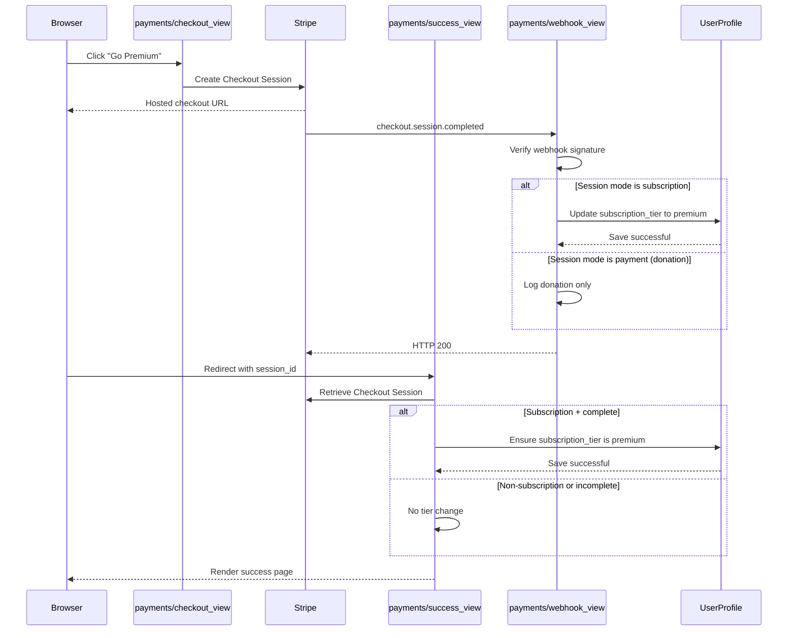

## **Architecture - Mindly Application**

This document covers the development strategy, app structure, and backend-frontend request-response flow patterns for the Mindly application.

---

## Table of Contents

- [Development Strategy](#development-strategy)
- [App Structure Justification](#app-structure-justification)
- [Backend-Frontend Flow Examples](#backend-frontend-flow-examples)

---

## **Development Strategy**

Mindly was developed using a domain-driven multi-app Django structure so each app maps to a natural product boundary:

- `users`: identity, profile, subscription state
- `journal`: mood/journal CRUD operations
- `assessments`: interactive self-check tools and persisted result records
- `payments`: Stripe checkout, webhook processing, and premium upgrade flow
- `pages`: static and premium resource views

Key architecture decisions:

- Use Django ORM for safe relational data handling and owner-scoped query patterns
- Use Stripe Checkout + webhook verification for secure payment lifecycle handling
- Use Bootstrap + custom CSS for responsive UI consistency across mobile/desktop
- Deploy on Heroku with environment-variable based secrets and production hardening

### **Build Constraints and Decisions**

- Kept app boundaries strict so each app has one clear responsibility
- Stored sensitive values in environment variables only
- Treated webhook signature verification as mandatory in production
- Prioritized clarity over complexity in UI and feature flows
- Focused on traceable evidence: tests, screenshots, and deployment checks

### **Development Process and Version Control**

The project was built in small stages and committed to GitHub regularly during development. Git and GitHub were used throughout to save progress, track changes, and keep a clear record of feature work, fixes, testing updates, and documentation updates.

This matters for the project criteria because version control is not only about having a repository — it is also evidence that the project was developed in a steady and traceable way rather than uploaded all at once at the end.

---

## **App Structure Justification**

Each Django app in Mindly has a single, well-defined domain responsibility. The table below explains why each boundary was drawn where it was.

| App | Domain | Reason for boundary |
|-----|---------|---------------------|
| `users` | Authentication, profiles, premium state | Handles all identity concerns independently so auth logic never leaks into feature apps |
| `journal` | Journal entries and mood tracking | Groups related CRUD models (`JournalEntry`, `MoodEntry`) under one owner-scoped domain |
| `assessments` | Guided self-check tools and result persistence | Isolated so self-check scoring and result history can evolve without touching journal or payment logic |
| `payments` | Stripe checkout, webhooks, subscription management | Payment concerns are sensitive and externally integrated — strict isolation reduces risk and simplifies testing |
| `pages` | Static pages, dashboard, public and premium resources | Thin presentation layer; separating it keeps feature apps free of generic page routing |

Cross-app communication is handled exclusively through model relationships and Django's URL routing. No app imports another app's views directly, preserving clean separation of concerns.

---

## **Backend-Frontend Flow Examples**

### **Flow 1: Journal CRUD**

1. User submits the journal form in the template (`templates/journal/journal_form.html`)
2. POST request is handled by `journal_create_view` in `journal/views.py`
3. Django form validates inputs and binds the entry to `request.user`
4. ORM saves `JournalEntry` into the database
5. User is redirected to journal list with a success message
6. Template renders updated list using query results for that logged-in user only

### **Flow 2: Premium Upgrade via Stripe Webhook**

1. User starts checkout from pricing/support page
2. `payments/checkout_view` creates Stripe Checkout Session
3. Stripe sends `checkout.session.completed` event to `payments/webhook/`
4. Webhook verifies signature with `STRIPE_WEBHOOK_SECRET`
5. Matching user is identified from metadata/email
6. Only `mode=subscription` events upgrade `UserProfile.subscription_tier` to `premium`
7. Premium-protected views become accessible through the `@premium_required` gate

Fallback note: when a user returns to `payments/success/` with `session_id`,
`success_view` also confirms Stripe session state and applies the premium upgrade
if required.

### **Sequence Diagram: Premium Upgrade Request-Response Path**

---

**Shehzad Moin, 2026**
