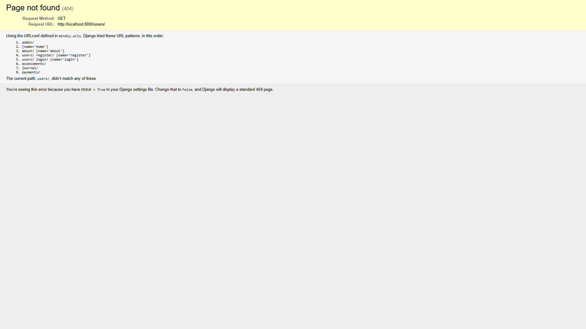
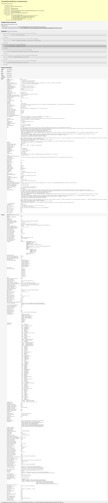
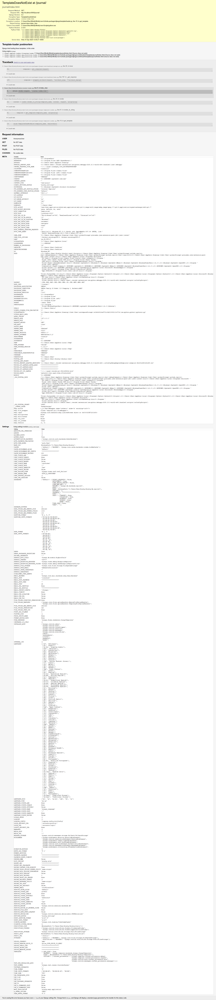

# Error Documentation - Development Phase

This document records errors encountered during development with visual evidence.

---

## Error 1: Users App - Page Not Found (404)

**URL**: `http://localhost:8000/users/`

**Status**: 404 Not Found

**Date Identified**: April 1, 2026

**Visual Evidence**:

**Brief Description**:
Accessing `/users/` returns a 404 because the users app does not define a root route.

**Fix**:
Add a root users route or redirect `/users/` to a valid page such as login, register, or dashboard.

---

## Error 2: Assessments App - Template Does Not Exist (500)

**URL**: `http://localhost:8000/assessments/`

**Status**: 500 Internal Server Error

**Date Identified**: April 1, 2026

**Visual Evidence**:

**Brief Description**:
Accessing `/assessments/` raises `TemplateDoesNotExist` because Django cannot find `assessments/index.html`.

**Fix**:
Create `templates/assessments/index.html` and ensure the assessments index view renders that template correctly.

---

## Error 3: Journal App - Template Does Not Exist (500)

**URL**: `http://localhost:8000/journal/`

**Status**: 500 Internal Server Error

**Date Identified**: April 1, 2026

**Visual Evidence**:

**Brief Description**:
Accessing `/journal/` raises `TemplateDoesNotExist` because Django cannot find `journal/index.html`.

**Fix**:
Create `templates/journal/index.html` and ensure the journal index view renders that template correctly.

---

## Error 4: Assessments App - Detailed Trace Capture (500)

**URL**: `http://localhost:8000/assessments/`

**Status**: 500 Internal Server Error

**Date Identified**: April 4, 2026

**Visual Evidence**:

**Brief Description**:
Accessing `/assessments/` shows the full template-loader traceback, confirming the missing `assessments/index.html` template.

**Fix**:
Create `templates/assessments/index.html` and ensure the assessments index view points to that template.

---

## Error 5: Journal App - Detailed Trace Capture (500)

**URL**: `http://localhost:8000/journal/`

**Status**: 500 Internal Server Error

**Date Identified**: April 4, 2026

**Visual Evidence**:

**Brief Description**:
Accessing `/journal/` shows the full template-loader traceback, confirming the missing `journal/index.html` template.

**Fix**:
Create `templates/journal/index.html` and ensure the journal index view points to that template.

---

## Summary

All five recorded errors represent incomplete features and template gaps captured during development:

1. **Users app**: URL routing incomplete
2. **Assessments app**: Template files not created (plus detailed traceback capture)
3. **Journal app**: Template files not created (plus detailed traceback capture)

These errors are expected during incremental development and will be resolved as each feature is implemented.

**Status**: All errors documented and awaiting implementation of respective features.

---

*Last Updated: April 4, 2026*
