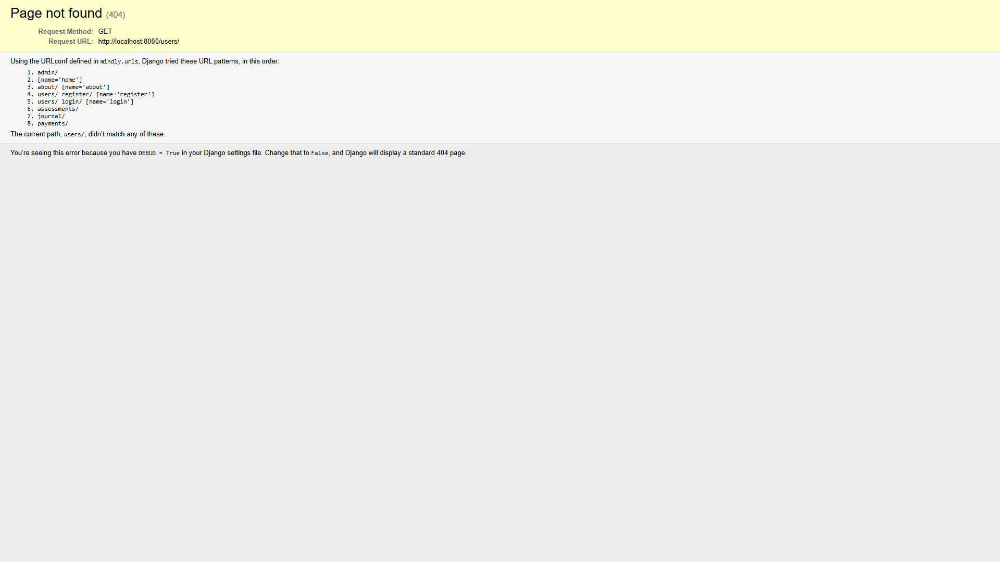
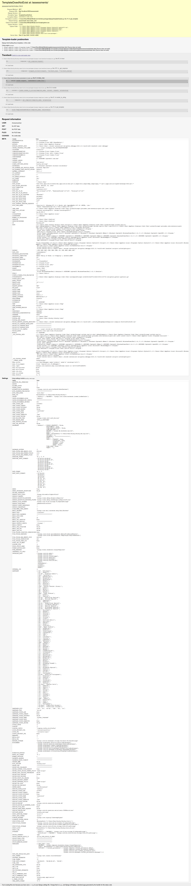
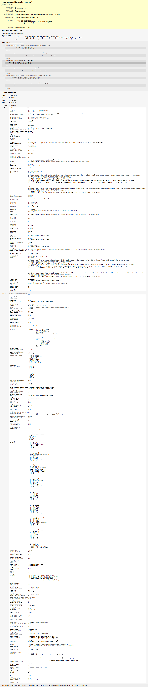

# Mindly Error Documentation

**Session**: 20260401_144924

**Date**: 22 May 2026 at 14:49:28

---

## 🔴 users_app_error

**URL**: http://localhost:8000/users/

**Description**: Users app root URL - no route configured

**Status Code**: 404

**Page Title**: Page not found at /users/

**Screenshot**: `users_app_error.png`

---

## ✅ assessments_template_error

**URL**: http://localhost:8000/assessments/

**Description**: Assessments app - missing template

**Status Code**: 500

**Page Title**: TemplateDoesNotExist at /assessments/

**Screenshot**: `assessments_template_error.png`

---

## ✅ journal_template_error

**URL**: http://localhost:8000/journal/

**Description**: Journal app - missing template

**Status Code**: 500

**Page Title**: TemplateDoesNotExist at /journal/

**Screenshot**: `journal_template_error.png`

---

